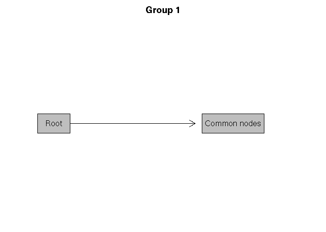
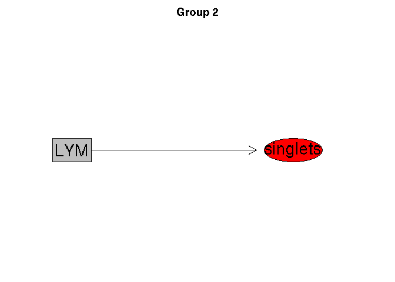

# QC for tcell panel

``` r
library(flowCore)
library(flowWorkspace)
library(cytoqc)
library(printr)
library(DT)
```

``` r
path <- "~/remote/fh/fast/gottardo_r/mike_working/lyoplate_out/parsed"
centers <- c('BIIR','CIMR','Miami','NHLBI','Stanford','UCLA','Yale')
```

## Load gs

``` r
panel <- "tcell"
gslist <- sapply(centers, function(center) {
  message("Center: ", center)
  gs <- load_gs(file.path(path, center, panel))
})
```

## QC Check gates

``` r
cqc_data <- cqc_gs_list(gslist)

#group by gates
groups <- cqc_check(cqc_data, "gate")
groups
```

<table class="table table-bordered" style="font-size: 12px; width: auto !important; ">

<thead>

<tr>

<th style="text-align:right;color: black !important;background-color: #e5f5e0 !important;">

group\_id

</th>

<th style="text-align:right;color: black !important;background-color: #e5f5e0 !important;">

nGatingSet

</th>

<th style="text-align:left;color: black !important;background-color: #e5f5e0 !important;">

gate

</th>

</tr>

</thead>

<tbody>

<tr>

<td style="text-align:right;">

2

</td>

<td style="text-align:right;">

5

</td>

<td style="text-align:left;">

4- 8+, 4- 8+/38- DR-, 4- 8+/38- DR+, 4- 8+/38+ DR-, 4- 8+/38+ DR+, 4-
8+/CCR7- 45RA-, 4- 8+/CCR7- 45RA+, 4- 8+/CCR7+ 45RA-, 4- 8+/CCR7+ 45RA+,
4+ 8-, 4+ 8-/38- DR-, 4+ 8-/38- DR+, 4+ 8-/38+ DR-, 4+ 8-/38+ DR+, 4+
8-/CCR7- 45RA-, 4+ 8-/CCR7- 45RA+, 4+ 8-/CCR7+ 45RA-, 4+ 8-/CCR7+ 45RA+,
CD3, DNT, DPT, LYM, not dead, root, singlets

</td>

</tr>

<tr>

<td style="text-align:right;">

1

</td>

<td style="text-align:right;">

2

</td>

<td style="text-align:left;">

4- 8+, 4- 8+/38- DR-, 4- 8+/38- DR+, 4- 8+/38+ DR-, 4- 8+/38+ DR+, 4-
8+/CCR7- 45RA-, 4- 8+/CCR7- 45RA+, 4- 8+/CCR7+ 45RA-, 4- 8+/CCR7+ 45RA+,
4+ 8-, 4+ 8-/38- DR-, 4+ 8-/38- DR+, 4+ 8-/38+ DR-, 4+ 8-/38+ DR+, 4+
8-/CCR7- 45RA-, 4+ 8-/CCR7- 45RA+, 4+ 8-/CCR7+ 45RA-, 4+ 8-/CCR7+ 45RA+,
CD3, DNT, DPT, LYM, not dead,
root

</td>

</tr>

</tbody>

</table>

``` r
diff(groups)
```

<table class="table table-bordered" style="font-size: 12px; width: auto !important; ">

<thead>

<tr>

<th style="text-align:right;color: black !important;background-color: #e5f5e0 !important;">

group\_id

</th>

<th style="text-align:right;color: black !important;background-color: #e5f5e0 !important;">

nGatingSet

</th>

<th style="text-align:left;color: black !important;background-color: #e5f5e0 !important;">

gate

</th>

</tr>

</thead>

<tbody>

<tr>

<td style="text-align:right;">

2

</td>

<td style="text-align:right;">

5

</td>

<td style="text-align:left;">

singlets

</td>

</tr>

</tbody>

</table>

``` r
#vis the difference
plot_diff(groups)
```

<!-- --><!-- -->

``` r
# match reference
match_result <- cqc_match(groups, ref = 1, select = c(2))
match_result
```

<table class="table table-bordered" style="font-size: 12px; width: auto !important; ">

<thead>

<tr>

<th style="text-align:left;color: black !important;background-color: #9ebcda !important;">

group\_id

</th>

<th style="text-align:left;color: black !important;background-color: #9ebcda !important;">

Not in
reference

</th>

<th style="text-align:left;color: black !important;background-color: #9ebcda !important;">

Missing channels

</th>

</tr>

</thead>

<tbody>

<tr>

<td style="text-align:left;font-weight: bold;">

2

</td>

<td style="text-align:left;">

singlets

</td>

<td style="text-align:left;">

</td>

</tr>

</tbody>

</table>

``` r
solution <- cqc_recommend(match_result)
solution
```

<table class="table table-bordered table-condensed" style="font-size: 12px; width: auto !important; ">

<thead>

<tr>

<th style="text-align:left;color: black !important;background-color: #e5f5e0 !important;">

Proposed change

</th>

</tr>

</thead>

<tbody>

<tr>

<td style="text-align:left;">

<span style="     text-decoration: line-through;">singlets</span>

</td>

</tr>

</tbody>

</table>

``` r
cqc_fix(solution)

cqc_check(cqc_data, "gate")
```

<table class="table table-bordered" style="font-size: 12px; width: auto !important; ">

<thead>

<tr>

<th style="text-align:right;color: black !important;background-color: #e5f5e0 !important;">

group\_id

</th>

<th style="text-align:right;color: black !important;background-color: #e5f5e0 !important;">

nGatingSet

</th>

<th style="text-align:left;color: black !important;background-color: #e5f5e0 !important;">

gate

</th>

</tr>

</thead>

<tbody>

<tr>

<td style="text-align:right;">

1

</td>

<td style="text-align:right;">

7

</td>

<td style="text-align:left;">

4- 8+, 4- 8+/38- DR-, 4- 8+/38- DR+, 4- 8+/38+ DR-, 4- 8+/38+ DR+, 4-
8+/CCR7- 45RA-, 4- 8+/CCR7- 45RA+, 4- 8+/CCR7+ 45RA-, 4- 8+/CCR7+ 45RA+,
4+ 8-, 4+ 8-/38- DR-, 4+ 8-/38- DR+, 4+ 8-/38+ DR-, 4+ 8-/38+ DR+, 4+
8-/CCR7- 45RA-, 4+ 8-/CCR7- 45RA+, 4+ 8-/CCR7+ 45RA-, 4+ 8-/CCR7+ 45RA+,
CD3, DNT, DPT, LYM, not dead, root

</td>

</tr>

</tbody>

</table>

## QC check for channel

``` r
groups <- cqc_check(cqc_data, "channel")
groups
```

<table class="table table-bordered" style="font-size: 12px; width: auto !important; ">

<thead>

<tr>

<th style="text-align:right;color: black !important;background-color: #e5f5e0 !important;">

group\_id

</th>

<th style="text-align:right;color: black !important;background-color: #e5f5e0 !important;">

nGatingSet

</th>

<th style="text-align:left;color: black !important;background-color: #e5f5e0 !important;">

channel

</th>

</tr>

</thead>

<tbody>

<tr>

<td style="text-align:right;">

1

</td>

<td style="text-align:right;">

1

</td>

<td style="text-align:left;">

\<Alexa Fluor 488-A\>, \<AmCyan-A\>, \<APC-A\>, \<APC-Cy7-A\>, \<Pacific
Blue-A\>, \<PE YG-A\>, \<PE-Cy7 YG-A\>, \<PerCP-Cy5-5-A\>, FSC-A, SSC-A,
Time

</td>

</tr>

<tr>

<td style="text-align:right;">

2

</td>

<td style="text-align:right;">

1

</td>

<td style="text-align:left;">

\<Am Cyan-A\>, \<APC-A\>, \<APC-Cy7-A\>, \<FITC-A\>, \<Pacific Blue-A\>,
\<PE-A\>, \<PE-Cy7-A\>, \<PerCP-Cy5-5-A\>, FSC-A, FSC-H, FSC-W, SSC-A,
SSC-H, SSC-W, Time

</td>

</tr>

<tr>

<td style="text-align:right;">

3

</td>

<td style="text-align:right;">

1

</td>

<td style="text-align:left;">

\<AmCyan-A\>, \<APC-A\>, \<APC-Cy7-A\>, \<FITC-A\>, \<Pacific Blue-A\>,
\<PE Cy7 YG-A\>, \<PE-A\>, \<PerCP-Cy5-5-A\>, FSC-A, FSC-W, SSC-A,
SSC-W, Time

</td>

</tr>

<tr>

<td style="text-align:right;">

4

</td>

<td style="text-align:right;">

1

</td>

<td style="text-align:left;">

\<APC-A\>, \<APC-Cy7-A\>, \<FITC-A\>, \<PE-A\>, \<PE-Cy7-A\>,
\<PerCP-Cy5-5-A\>, \<V450-A\>, \<V500-A\>, FSC-A, SSC-A, Time

</td>

</tr>

<tr>

<td style="text-align:right;">

5

</td>

<td style="text-align:right;">

1

</td>

<td style="text-align:left;">

\<APC-A\>, \<APC-H7-A\>, \<BD Horizon V450-A\>, \<BD Horizon V500-A\>,
\<FITC-A\>, \<PE-A\>, \<PE-Cy7-A\>, \<PerCP-Cy5-5-A\>, FSC-A, FSC-H,
FSC-W, SSC-A, SSC-H, SSC-W, Time

</td>

</tr>

<tr>

<td style="text-align:right;">

6

</td>

<td style="text-align:right;">

1

</td>

<td style="text-align:left;">

\<APC-A\>, \<APC-H7-A\>, \<FITC-A\>, \<PE-A\>, \<PE-Cy7-A\>,
\<PerCP-Cy5-5-A\>, \<V450-A\>, \<V500-A\>, FSC-A, FSC-H, SSC-A, SSC-H,
Time

</td>

</tr>

<tr>

<td style="text-align:right;">

7

</td>

<td style="text-align:right;">

1

</td>

<td style="text-align:left;">

\<B515-A\>, \<B710-A\>, \<G560-A\>, \<G780-A\>, \<R660-A\>, \<R780-A\>,
\<V450-A\>, \<V545-A\>, FSC-A, FSC-H, FSC-W, SSC-A, SSC-H, SSC-W, Time

</td>

</tr>

</tbody>

</table>

## Channels are very different across centers so move on to check marker

``` r
groups <- cqc_check(cqc_data, "marker")
groups
```

<table class="table table-bordered" style="font-size: 12px; width: auto !important; ">

<thead>

<tr>

<th style="text-align:right;color: black !important;background-color: #e5f5e0 !important;">

group\_id

</th>

<th style="text-align:right;color: black !important;background-color: #e5f5e0 !important;">

nGatingSet

</th>

<th style="text-align:left;color: black !important;background-color: #e5f5e0 !important;">

marker

</th>

</tr>

</thead>

<tbody>

<tr>

<td style="text-align:right;">

6

</td>

<td style="text-align:right;">

2

</td>

<td style="text-align:left;">

CD197, CD3, CD38, CD4, CD45RA, CD8, HLA-DR, Live Green

</td>

</tr>

<tr>

<td style="text-align:right;">

1

</td>

<td style="text-align:right;">

1

</td>

<td style="text-align:left;">

CCR7 PE, CD3 V450, CD38 APC, CD4 PerCP-Cy55, CD45RA PE-Cy7, CD8 APC-H7,
HLA-DR V500, Live Dead FITC

</td>

</tr>

<tr>

<td style="text-align:right;">

2

</td>

<td style="text-align:right;">

1

</td>

<td style="text-align:left;">

CCR7, CD3, CD38, CD4, CD45RA, CD8, HLA DR, Live/Dead

</td>

</tr>

<tr>

<td style="text-align:right;">

3

</td>

<td style="text-align:right;">

1

</td>

<td style="text-align:left;">

CCR7, CD3, CD38, CD4, CD45RA, CD8, HLA-DR, LIVE

</td>

</tr>

<tr>

<td style="text-align:right;">

4

</td>

<td style="text-align:right;">

1

</td>

<td style="text-align:left;">

CCR7, CD3, CD38, CD4, CD45RA, CD8, HLADR, LIVE\_GREEN

</td>

</tr>

<tr>

<td style="text-align:right;">

5

</td>

<td style="text-align:right;">

1

</td>

<td style="text-align:left;">

CD197, CD3, CD38, CD4, CD45RA, CD8, HLA-DR, LIVE DEAD

</td>

</tr>

</tbody>

</table>

## Markers are more standardized and go ahead to further clean it

``` r
res <- cqc_match(groups, ref = 3) 
res
```

<table class="table table-bordered" style="font-size: 12px; width: auto !important; ">

<thead>

<tr>

<th style="text-align:left;color: black !important;background-color: #9ebcda !important;">

group\_id

</th>

<th style="text-align:left;color: black !important;background-color: #9ebcda !important;">

Not in
reference

</th>

<th style="text-align:left;color: black !important;background-color: #9ebcda !important;">

Missing channels

</th>

</tr>

</thead>

<tbody>

<tr>

<td style="text-align:left;font-weight: bold;">

1

</td>

<td style="text-align:left;">

CCR7 PE,CD3 V450,CD38 APC,CD4 PerCP-Cy55,CD45RA PE-Cy7,CD8 APC-H7,HLA-DR
V500,Live Dead FITC

</td>

<td style="text-align:left;">

CCR7,CD3,CD38,CD4,CD45RA,CD8,HLA-DR,LIVE

</td>

</tr>

<tr>

<td style="text-align:left;font-weight: bold;">

2

</td>

<td style="text-align:left;">

HLA DR,Live/Dead

</td>

<td style="text-align:left;">

HLA-DR,LIVE

</td>

</tr>

<tr>

<td style="text-align:left;font-weight: bold;">

4

</td>

<td style="text-align:left;">

HLADR,LIVE\_GREEN

</td>

<td style="text-align:left;">

HLA-DR,LIVE

</td>

</tr>

<tr>

<td style="text-align:left;font-weight: bold;">

5

</td>

<td style="text-align:left;">

CD197,LIVE DEAD

</td>

<td style="text-align:left;">

CCR7,LIVE

</td>

</tr>

<tr>

<td style="text-align:left;font-weight: bold;">

6

</td>

<td style="text-align:left;">

CD197,Live Green

</td>

<td style="text-align:left;">

CCR7,LIVE

</td>

</tr>

</tbody>

</table>

``` r
solution <- cqc_recommend(res, max.distance = 0.6)
solution
```

<table class="table table-bordered table-condensed" style="font-size: 12px; width: auto !important; ">

<thead>

<tr>

<th style="text-align:left;color: black !important;background-color: #e5f5e0 !important;">

Proposed change

</th>

</tr>

</thead>

<tbody>

<tr>

<td style="text-align:left;">

CCR7 PE –\> CCR7

</td>

</tr>

<tr>

<td style="text-align:left;">

CD38 APC –\> CD38

</td>

</tr>

<tr>

<td style="text-align:left;">

CD3 V450 –\> CD3

</td>

</tr>

<tr>

<td style="text-align:left;">

HLA-DR V500 –\> HLA-DR

</td>

</tr>

<tr>

<td style="text-align:left;">

CD45RA PE-Cy7 –\> CD45RA

</td>

</tr>

<tr>

<td style="text-align:left;">

HLA DR –\> HLA-DR

</td>

</tr>

<tr>

<td style="text-align:left;">

Live/Dead –\> LIVE

</td>

</tr>

<tr>

<td style="text-align:left;">

HLADR –\> HLA-DR

</td>

</tr>

<tr>

<td style="text-align:left;">

LIVE\_GREEN –\> LIVE

</td>

</tr>

<tr>

<td style="text-align:left;">

CD197 –\> CCR7

</td>

</tr>

<tr>

<td style="text-align:left;">

LIVE DEAD –\> LIVE

</td>

</tr>

<tr>

<td style="text-align:left;">

Live Green –\> LIVE

</td>

</tr>

</tbody>

</table>

``` r
cqc_fix(solution)
```

## update checks

``` r
groups <- cqc_check(cqc_data, "marker")
groups
```

<table class="table table-bordered" style="font-size: 12px; width: auto !important; ">

<thead>

<tr>

<th style="text-align:right;color: black !important;background-color: #e5f5e0 !important;">

group\_id

</th>

<th style="text-align:right;color: black !important;background-color: #e5f5e0 !important;">

nGatingSet

</th>

<th style="text-align:left;color: black !important;background-color: #e5f5e0 !important;">

marker

</th>

</tr>

</thead>

<tbody>

<tr>

<td style="text-align:right;">

2

</td>

<td style="text-align:right;">

6

</td>

<td style="text-align:left;">

CCR7, CD3, CD38, CD4, CD45RA, CD8, HLA-DR, LIVE

</td>

</tr>

<tr>

<td style="text-align:right;">

1

</td>

<td style="text-align:right;">

1

</td>

<td style="text-align:left;">

CCR7, CD3, CD38, CD4 PerCP-Cy55, CD45RA, CD8 APC-H7, HLA-DR, Live Dead
FITC

</td>

</tr>

</tbody>

</table>

## Relax string matching to clean up the rest

``` r
res <- cqc_match(groups, ref = 2) 
res
```

<table class="table table-bordered" style="font-size: 12px; width: auto !important; ">

<thead>

<tr>

<th style="text-align:left;color: black !important;background-color: #9ebcda !important;">

group\_id

</th>

<th style="text-align:left;color: black !important;background-color: #9ebcda !important;">

Not in
reference

</th>

<th style="text-align:left;color: black !important;background-color: #9ebcda !important;">

Missing channels

</th>

</tr>

</thead>

<tbody>

<tr>

<td style="text-align:left;font-weight: bold;">

1

</td>

<td style="text-align:left;">

CD4 PerCP-Cy55,CD8 APC-H7,Live Dead FITC

</td>

<td style="text-align:left;">

CD4,CD8,LIVE

</td>

</tr>

</tbody>

</table>

``` r
solution <- cqc_recommend(res, max.distance = 0.8)
solution
```

<table class="table table-bordered table-condensed" style="font-size: 12px; width: auto !important; ">

<thead>

<tr>

<th style="text-align:left;color: black !important;background-color: #e5f5e0 !important;">

Proposed change

</th>

</tr>

</thead>

<tbody>

<tr>

<td style="text-align:left;">

CD8 APC-H7 –\> CD8

</td>

</tr>

<tr>

<td style="text-align:left;">

Live Dead FITC –\> LIVE

</td>

</tr>

<tr>

<td style="text-align:left;">

CD4 PerCP-Cy55 –\> CD4

</td>

</tr>

</tbody>

</table>

``` r
cqc_fix(solution)

cqc_check(cqc_data, "marker")
```

<table class="table table-bordered" style="font-size: 12px; width: auto !important; ">

<thead>

<tr>

<th style="text-align:right;color: black !important;background-color: #e5f5e0 !important;">

group\_id

</th>

<th style="text-align:right;color: black !important;background-color: #e5f5e0 !important;">

nGatingSet

</th>

<th style="text-align:left;color: black !important;background-color: #e5f5e0 !important;">

marker

</th>

</tr>

</thead>

<tbody>

<tr>

<td style="text-align:right;">

1

</td>

<td style="text-align:right;">

7

</td>

<td style="text-align:left;">

CCR7, CD3, CD38, CD4, CD45RA, CD8, HLA-DR, LIVE

</td>

</tr>

</tbody>

</table>

## check pannel

``` r
res <- cqc_check(cqc_data, "panel")
datatable(res)
```

<!--html_preserve-->

<div id="htmlwidget-0f1e839db43c573eba75" class="datatables html-widget" style="width:100%;height:auto;">

</div>

<script type="application/json" data-for="htmlwidget-0f1e839db43c573eba75">{"x":{"filter":"none","data":[["1","2","3","4","5","6","7","8","9","10","11","12","13","14","15","16","17","18","19","20","21","22","23","24","25","26","27","28","29","30","31","32","33","34","35","36","37","38","39","40","41","42","43","44","45","46","47","48","49","50","51","52","53","54","55","56"],["fa2432d8-e52c-4953-b549-6cdae382099a","fa2432d8-e52c-4953-b549-6cdae382099a","fa2432d8-e52c-4953-b549-6cdae382099a","fa2432d8-e52c-4953-b549-6cdae382099a","fa2432d8-e52c-4953-b549-6cdae382099a","fa2432d8-e52c-4953-b549-6cdae382099a","fa2432d8-e52c-4953-b549-6cdae382099a","fa2432d8-e52c-4953-b549-6cdae382099a","b7078dad-fd23-44b0-a0cf-eae65b87bc2c","b7078dad-fd23-44b0-a0cf-eae65b87bc2c","b7078dad-fd23-44b0-a0cf-eae65b87bc2c","b7078dad-fd23-44b0-a0cf-eae65b87bc2c","b7078dad-fd23-44b0-a0cf-eae65b87bc2c","b7078dad-fd23-44b0-a0cf-eae65b87bc2c","b7078dad-fd23-44b0-a0cf-eae65b87bc2c","b7078dad-fd23-44b0-a0cf-eae65b87bc2c","5c2f4132-cdba-416c-9b03-16fa61db93df","5c2f4132-cdba-416c-9b03-16fa61db93df","5c2f4132-cdba-416c-9b03-16fa61db93df","5c2f4132-cdba-416c-9b03-16fa61db93df","5c2f4132-cdba-416c-9b03-16fa61db93df","5c2f4132-cdba-416c-9b03-16fa61db93df","5c2f4132-cdba-416c-9b03-16fa61db93df","5c2f4132-cdba-416c-9b03-16fa61db93df","706f1264-8b3c-44a3-9184-bc3be38d8604","706f1264-8b3c-44a3-9184-bc3be38d8604","706f1264-8b3c-44a3-9184-bc3be38d8604","706f1264-8b3c-44a3-9184-bc3be38d8604","706f1264-8b3c-44a3-9184-bc3be38d8604","706f1264-8b3c-44a3-9184-bc3be38d8604","706f1264-8b3c-44a3-9184-bc3be38d8604","706f1264-8b3c-44a3-9184-bc3be38d8604","b55ed8d1-b99a-4ea0-95c0-86bcc32a2d60","b55ed8d1-b99a-4ea0-95c0-86bcc32a2d60","b55ed8d1-b99a-4ea0-95c0-86bcc32a2d60","b55ed8d1-b99a-4ea0-95c0-86bcc32a2d60","b55ed8d1-b99a-4ea0-95c0-86bcc32a2d60","b55ed8d1-b99a-4ea0-95c0-86bcc32a2d60","b55ed8d1-b99a-4ea0-95c0-86bcc32a2d60","b55ed8d1-b99a-4ea0-95c0-86bcc32a2d60","e1c3f750-59bf-48ab-9a29-4064aaeeeb30","e1c3f750-59bf-48ab-9a29-4064aaeeeb30","e1c3f750-59bf-48ab-9a29-4064aaeeeb30","e1c3f750-59bf-48ab-9a29-4064aaeeeb30","e1c3f750-59bf-48ab-9a29-4064aaeeeb30","e1c3f750-59bf-48ab-9a29-4064aaeeeb30","e1c3f750-59bf-48ab-9a29-4064aaeeeb30","e1c3f750-59bf-48ab-9a29-4064aaeeeb30","d69e11e5-d0e2-4549-8641-3c8d90c58603","d69e11e5-d0e2-4549-8641-3c8d90c58603","d69e11e5-d0e2-4549-8641-3c8d90c58603","d69e11e5-d0e2-4549-8641-3c8d90c58603","d69e11e5-d0e2-4549-8641-3c8d90c58603","d69e11e5-d0e2-4549-8641-3c8d90c58603","d69e11e5-d0e2-4549-8641-3c8d90c58603","d69e11e5-d0e2-4549-8641-3c8d90c58603"],["&lt;APC-A&gt;","&lt;APC-H7-A&gt;","&lt;FITC-A&gt;","&lt;PE-A&gt;","&lt;PE-Cy7-A&gt;","&lt;PerCP-Cy5-5-A&gt;","&lt;V450-A&gt;","&lt;V500-A&gt;","&lt;Alexa Fluor 488-A&gt;","&lt;AmCyan-A&gt;","&lt;APC-A&gt;","&lt;APC-Cy7-A&gt;","&lt;Pacific Blue-A&gt;","&lt;PE YG-A&gt;","&lt;PE-Cy7 YG-A&gt;","&lt;PerCP-Cy5-5-A&gt;","&lt;AmCyan-A&gt;","&lt;APC-A&gt;","&lt;APC-Cy7-A&gt;","&lt;FITC-A&gt;","&lt;Pacific Blue-A&gt;","&lt;PE Cy7 YG-A&gt;","&lt;PE-A&gt;","&lt;PerCP-Cy5-5-A&gt;","&lt;B515-A&gt;","&lt;B710-A&gt;","&lt;G560-A&gt;","&lt;G780-A&gt;","&lt;R660-A&gt;","&lt;R780-A&gt;","&lt;V450-A&gt;","&lt;V545-A&gt;","&lt;Am Cyan-A&gt;","&lt;APC-A&gt;","&lt;APC-Cy7-A&gt;","&lt;FITC-A&gt;","&lt;Pacific Blue-A&gt;","&lt;PE-A&gt;","&lt;PE-Cy7-A&gt;","&lt;PerCP-Cy5-5-A&gt;","&lt;APC-A&gt;","&lt;APC-H7-A&gt;","&lt;BD Horizon V450-A&gt;","&lt;BD Horizon V500-A&gt;","&lt;FITC-A&gt;","&lt;PE-A&gt;","&lt;PE-Cy7-A&gt;","&lt;PerCP-Cy5-5-A&gt;","&lt;APC-A&gt;","&lt;APC-Cy7-A&gt;","&lt;FITC-A&gt;","&lt;PE-A&gt;","&lt;PE-Cy7-A&gt;","&lt;PerCP-Cy5-5-A&gt;","&lt;V450-A&gt;","&lt;V500-A&gt;"],["CD38","CD8","LIVE","CCR7","CD45RA","CD4","CD3","HLA-DR","LIVE","HLA-DR","CD38","CD8","CD3","CCR7","CD45RA","CD4","HLA-DR","CD38","CD8","LIVE","CD3","CD45RA","CCR7","CD4","LIVE","CD4","CCR7","CD45RA","CD38","CD8","CD3","HLA-DR","HLA-DR","CD38","CD8","LIVE","CD3","CCR7","CD45RA","CD4","CD38","CD8","CD3","HLA-DR","LIVE","CCR7","CD45RA","CD4","CD38","CD8","LIVE","CCR7","CD45RA","CD4","CD3","HLA-DR"],[6,6,6,6,6,6,6,6,1,1,1,1,1,1,1,1,3,3,3,3,3,3,3,3,7,7,7,7,7,7,7,7,2,2,2,2,2,2,2,2,5,5,5,5,5,5,5,5,4,4,4,4,4,4,4,4],[1,1,1,1,1,1,1,1,1,1,1,1,1,1,1,1,1,1,1,1,1,1,1,1,1,1,1,1,1,1,1,1,1,1,1,1,1,1,1,1,1,1,1,1,1,1,1,1,1,1,1,1,1,1,1,1]],"container":"<table class=\"display\">\n  <thead>\n    <tr>\n      <th> <\/th>\n      <th>object<\/th>\n      <th>channel<\/th>\n      <th>marker<\/th>\n      <th>group_id<\/th>\n      <th>nObject<\/th>\n    <\/tr>\n  <\/thead>\n<\/table>","options":{"columnDefs":[{"className":"dt-right","targets":[4,5]},{"orderable":false,"targets":0}],"order":[],"autoWidth":false,"orderClasses":false}},"evals":[],"jsHooks":[]}</script>

<!--/html_preserve-->

``` r
datatable(format(res, anchor = "marker"))
```

<!--html_preserve-->

<div id="htmlwidget-edf4923fed16a80ffdec" class="datatables html-widget" style="width:100%;height:auto;">

</div>

<script type="application/json" data-for="htmlwidget-edf4923fed16a80ffdec">{"x":{"filter":"none","data":[["1","2","3","4","5","6","7","8"],["CCR7","CD3","CD38","CD4","CD45RA","CD8","HLA-DR","LIVE"],["&lt;PE YG-A&gt;","&lt;Pacific Blue-A&gt;","&lt;APC-A&gt;","&lt;PerCP-Cy5-5-A&gt;","&lt;PE-Cy7 YG-A&gt;","&lt;APC-Cy7-A&gt;","&lt;AmCyan-A&gt;","&lt;Alexa Fluor 488-A&gt;"],["&lt;PE-A&gt;","&lt;Pacific Blue-A&gt;","&lt;APC-A&gt;","&lt;PerCP-Cy5-5-A&gt;","&lt;PE-Cy7-A&gt;","&lt;APC-Cy7-A&gt;","&lt;Am Cyan-A&gt;","&lt;FITC-A&gt;"],["&lt;PE-A&gt;","&lt;Pacific Blue-A&gt;","&lt;APC-A&gt;","&lt;PerCP-Cy5-5-A&gt;","&lt;PE Cy7 YG-A&gt;","&lt;APC-Cy7-A&gt;","&lt;AmCyan-A&gt;","&lt;FITC-A&gt;"],["&lt;PE-A&gt;","&lt;V450-A&gt;","&lt;APC-A&gt;","&lt;PerCP-Cy5-5-A&gt;","&lt;PE-Cy7-A&gt;","&lt;APC-Cy7-A&gt;","&lt;V500-A&gt;","&lt;FITC-A&gt;"],["&lt;PE-A&gt;","&lt;BD Horizon V450-A&gt;","&lt;APC-A&gt;","&lt;PerCP-Cy5-5-A&gt;","&lt;PE-Cy7-A&gt;","&lt;APC-H7-A&gt;","&lt;BD Horizon V500-A&gt;","&lt;FITC-A&gt;"],["&lt;PE-A&gt;","&lt;V450-A&gt;","&lt;APC-A&gt;","&lt;PerCP-Cy5-5-A&gt;","&lt;PE-Cy7-A&gt;","&lt;APC-H7-A&gt;","&lt;V500-A&gt;","&lt;FITC-A&gt;"],["&lt;G560-A&gt;","&lt;V450-A&gt;","&lt;R660-A&gt;","&lt;B710-A&gt;","&lt;G780-A&gt;","&lt;R780-A&gt;","&lt;V545-A&gt;","&lt;B515-A&gt;"]],"container":"<table class=\"display\">\n  <thead>\n    <tr>\n      <th> <\/th>\n      <th>marker<\/th>\n      <th>group 1(n=1)<\/th>\n      <th>group 2(n=1)<\/th>\n      <th>group 3(n=1)<\/th>\n      <th>group 4(n=1)<\/th>\n      <th>group 5(n=1)<\/th>\n      <th>group 6(n=1)<\/th>\n      <th>group 7(n=1)<\/th>\n    <\/tr>\n  <\/thead>\n<\/table>","options":{"order":[],"autoWidth":false,"orderClasses":false,"columnDefs":[{"orderable":false,"targets":0}]}},"evals":[],"jsHooks":[]}</script>

<!--/html_preserve-->

## Use the marker as reference to standardize the channels across centers

``` r
cf <- gs_cyto_data(cqc_data[[1]])[[1]]
panel <- cf_get_panel(cf, skip_na = TRUE)
panel
```

<table>

<thead>

<tr>

<th style="text-align:left;">

channel

</th>

<th style="text-align:left;">

marker

</th>

</tr>

</thead>

<tbody>

<tr>

<td style="text-align:left;">

\<APC-A\>

</td>

<td style="text-align:left;">

CD38

</td>

</tr>

<tr>

<td style="text-align:left;">

\<APC-H7-A\>

</td>

<td style="text-align:left;">

CD8

</td>

</tr>

<tr>

<td style="text-align:left;">

\<FITC-A\>

</td>

<td style="text-align:left;">

LIVE

</td>

</tr>

<tr>

<td style="text-align:left;">

\<PerCP-Cy5-5-A\>

</td>

<td style="text-align:left;">

CD4

</td>

</tr>

<tr>

<td style="text-align:left;">

\<V450-A\>

</td>

<td style="text-align:left;">

CD3

</td>

</tr>

<tr>

<td style="text-align:left;">

\<V500-A\>

</td>

<td style="text-align:left;">

HLA-DR

</td>

</tr>

<tr>

<td style="text-align:left;">

\<PE-A\>

</td>

<td style="text-align:left;">

CCR7

</td>

</tr>

<tr>

<td style="text-align:left;">

\<PE-Cy7-A\>

</td>

<td style="text-align:left;">

CD45RA

</td>

</tr>

</tbody>

</table>

``` r
cqc_set_panel(cqc_data, panel, ref.col = "marker")
groups <- cqc_check(cqc_data, "panel")
groups
```

<!--html_preserve-->

<div id="htmlwidget-fd685fcfd55406eb78e2" class="datatables html-widget" style="width:960px;height:500px;">

</div>

<script type="application/json" data-for="htmlwidget-fd685fcfd55406eb78e2">{"x":{"filter":"none","data":[["1","2","3","4","5","6","7","8"],["&lt;APC-A&gt;","&lt;APC-H7-A&gt;","&lt;FITC-A&gt;","&lt;PE-A&gt;","&lt;PE-Cy7-A&gt;","&lt;PerCP-Cy5-5-A&gt;","&lt;V450-A&gt;","&lt;V500-A&gt;"],["CD38","CD8","LIVE","CCR7","CD45RA","CD4","CD3","HLA-DR"]],"container":"<table class=\"display\">\n  <thead>\n    <tr>\n      <th> <\/th>\n      <th>channel<\/th>\n      <th>group 1(n=7)<\/th>\n    <\/tr>\n  <\/thead>\n<\/table>","options":{"order":[],"autoWidth":false,"orderClasses":false,"columnDefs":[{"orderable":false,"targets":0}]}},"evals":[],"jsHooks":[]}</script>

<!--/html_preserve-->

## Refresh QC report

``` r
groups <- cqc_check(cqc_data, "channel")
diff(groups)
```

<table class="table table-bordered" style="font-size: 12px; width: auto !important; ">

<thead>

<tr>

<th style="text-align:right;color: black !important;background-color: #e5f5e0 !important;">

group\_id

</th>

<th style="text-align:right;color: black !important;background-color: #e5f5e0 !important;">

nGatingSet

</th>

<th style="text-align:left;color: black !important;background-color: #e5f5e0 !important;">

channel

</th>

</tr>

</thead>

<tbody>

<tr>

<td style="text-align:right;">

1

</td>

<td style="text-align:right;">

3

</td>

<td style="text-align:left;">

FSC-H, FSC-W, SSC-H, SSC-W

</td>

</tr>

<tr>

<td style="text-align:right;">

2

</td>

<td style="text-align:right;">

1

</td>

<td style="text-align:left;">

FSC-H, SSC-H

</td>

</tr>

<tr>

<td style="text-align:right;">

3

</td>

<td style="text-align:right;">

1

</td>

<td style="text-align:left;">

FSC-W, SSC-W

</td>

</tr>

</tbody>

</table>

## Remove `H/W` channels

``` r
res <- cqc_match(groups, ref = 4) 
res
```

<table class="table table-bordered" style="font-size: 12px; width: auto !important; ">

<thead>

<tr>

<th style="text-align:left;color: black !important;background-color: #9ebcda !important;">

group\_id

</th>

<th style="text-align:left;color: black !important;background-color: #9ebcda !important;">

Not in
reference

</th>

<th style="text-align:left;color: black !important;background-color: #9ebcda !important;">

Missing channels

</th>

</tr>

</thead>

<tbody>

<tr>

<td style="text-align:left;font-weight: bold;">

1

</td>

<td style="text-align:left;">

FSC-H,FSC-W,SSC-H,SSC-W

</td>

<td style="text-align:left;">

</td>

</tr>

<tr>

<td style="text-align:left;font-weight: bold;">

2

</td>

<td style="text-align:left;">

FSC-H,SSC-H

</td>

<td style="text-align:left;">

</td>

</tr>

<tr>

<td style="text-align:left;font-weight: bold;">

3

</td>

<td style="text-align:left;">

FSC-W,SSC-W

</td>

<td style="text-align:left;">

</td>

</tr>

</tbody>

</table>

``` r
solution <- cqc_recommend(res, max.distance = 0.6)
solution
```

<table class="table table-bordered table-condensed" style="font-size: 12px; width: auto !important; ">

<thead>

<tr>

<th style="text-align:left;color: black !important;background-color: #e5f5e0 !important;">

Proposed change

</th>

</tr>

</thead>

<tbody>

<tr>

<td style="text-align:left;">

<span style="     text-decoration: line-through;">FSC-H</span>

</td>

</tr>

<tr>

<td style="text-align:left;">

<span style="     text-decoration: line-through;">FSC-W</span>

</td>

</tr>

<tr>

<td style="text-align:left;">

<span style="     text-decoration: line-through;">SSC-H</span>

</td>

</tr>

<tr>

<td style="text-align:left;">

<span style="     text-decoration: line-through;">SSC-W</span>

</td>

</tr>

</tbody>

</table>

``` r
cqc_fix(solution)
```

## Coerce it directly into single `GatingSet` (zero-copying)

``` r
gs <- merge_list_to_gs(cqc_data)
gs
```

    ## A GatingSet with 63 samples
